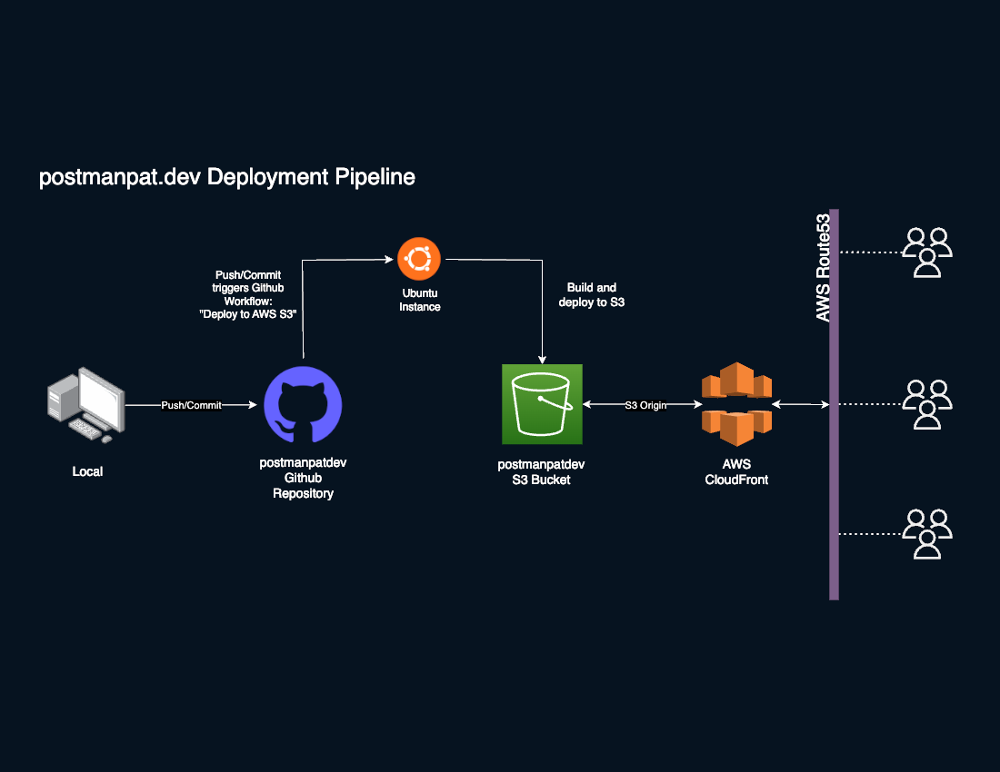

# Anatomy of postmanpat.dev

As [postmanpat.dev](http://postmanpat.dev) is a portfolio/blog website, I needed a simple, quick and easy pipeline for a Gatsby site. The pipeline needed to satisfy the following requirements:
- Utulize AWS ecosystem
- Main codebase to reside in GitHub (as oppose to AWS CodeCommit)
- Able to build and deploy upon push to the repository
- Cost efficient
- Low maintenance
- Secure
- Simple automatic deployment of resources

In exploring several options, including deployment and hosting via an EC2 instance, I found the following solution to be the most simple and cost efficient, requiring minimal usage and upkeep of AWS resources whilst maintaining the codebase in GitHub.

## CI/CD Architecture

### Diagram of postmanpat.dev CI/CD 


postmanpat.dev is hosted on Amazon S3 bucket with a CI/CD pipeline utulizing Github Workflows to build, compile and deploy to S3 via an Ubuntu instance. Upon new pushes or merges to the main repository, the GitHub Workflow will trigger a new page build and automatically deploy to the S3 bucket. The content is then served via AWS Cloudfront (S3 Origin) and Route53 (Domain resides in GoDaddy).

Below is the Github Workflow file used to build and deploy to AWS S3. It carries out the following actions:
- Setup and Ubuntu instance (AWS CLI is included natively withint this instance)
- Setup AWS variables
- Install nodeJS
- Install project Dependencies
- Install Gatsby CLI
- Install Gatsby S3 Plugin
- Deploy to S3 via Gatsby CLI command


## GitHub Workflow File

```yaml
name: Deploy to AWS S3

run-name: Deploy postmanpatdev to S3

on:
  push:
    branches: main

jobs:
  build-and-deploy:
    name: Build and deploy website

    runs-on: ubuntu-latest

    env:
      AWS_ACCESS_KEY_ID: ${{ secrets.AWS_ACCESS_KEY_ID }}
      AWS_SECRET_ACCESS_KEY: ${{ secrets.AWS_SECRET_ACCESS_KEY }}
      AWS_DEFAULT_REGION: "ap-southeast-2"

    steps:
      - name: Checkout Repository
        uses: actions/checkout@v2

      - name: Install Node.js
        uses: actions/setup-node@v4
        with:
          node-version: "18.x"

      - name: Install Project Dependencies
        run: npm i --force

      - name: Install Gatsby CLI
        run: npm install -g gatsby-cli@^5.11

      - name: Install Gatsby Plugin S3
        run: npm install gatsby-plugin-s3 --force

      - name: Configure AWS CLI Credentials
        run: aws configure set aws_access_key_id "$AWS_ACCESS_KEY_ID" && aws configure set aws_secret_access_key "$AWS_SECRET_ACCESS_KEY" && aws configure set region "$AWS_DEFAULT_REGION" && aws configure set output "json"

      - name: Deploy to S3
        run: npm run build && npm run deploy
```

## Cloudformation Template

Below is the Cloudformation template used to setup the AWS resources required to host the website. It creates the following resources in AWS:
- S3 Buckets with public access allowed
- IAM User with specific credentaials (IAM Policy) required by Gatsby CLI for deployment to the S3 Bucket

Note: this file does not include setting up of AWS Cloudfront, AWS Route53, AWS ACM (SSL Certificates) resources as they require manual confgiuration depending on the Domain Registrar.

```yaml
Description: Deploy postmanpat.dev to S3

Resources:
  postmanpatS3Bucket:
    Type: AWS::S3::Bucket
    Properties:
      BucketName: "postmanpatdev"
      PublicAccessBlockConfiguration:
        BlockPublicAcls: false
        BlockPublicPolicy: false
        IgnorePublicAcls: false
        RestrictPublicBuckets: false
      OwnershipControls:
        Rules:
          - ObjectOwnership: BucketOwnerPreferred
      WebsiteConfiguration:
        IndexDocument: "index.html"
        ErrorDocument: "error.html"

  postmanpatUser:
    Type: "AWS::IAM::User"

  postmanpatUserPolicy:
    Type: "AWS::IAM::Policy"
    Properties:
      PolicyName: "postmanpatUserPolicy"
      PolicyDocument:
        Version: "2012-10-17"
        Statement:
          - Effect: "Allow"
            Action:
              - "s3:GetObject"
              - "s3:PutObject"
              - "s3:ListBucket"
              - "s3:DeleteObject"
              - "S3:PutBucketAcl"
              - "s3:GetBucketLocation"
              - "s3:PutBucketWebsite"
              - "S3:PutObjectAcl"
            Resource:
              - !Sub "arn:aws:s3:::${postmanpatS3Bucket}"
              - !Sub "arn:aws:s3:::${postmanpatS3Bucket}/*"
      Users:
        - !Ref postmanpatUser

  postmanpatAccessKey:
    Type: "AWS::IAM::AccessKey"
    Properties:
      UserName: !Ref postmanpatUser

Outputs:
  S3BucketName:
    Description: "Name of the created S3 bucket"
    Value: !Ref postmanpatS3Bucket

  S3StaticWebsiteURL:
    Description: "URL of the static website hosted in the S3 bucket"
    Value: !Sub "http://${postmanpatS3Bucket}.s3-website-${AWS::Region}.amazonaws.com/"

  UserAccessKeyId:
    Value: !Ref postmanpatAccessKey
    Description: "Access Key ID for the IAM user"

  UserSecretKey:
    Value: !GetAtt postmanpatAccessKey.SecretAccessKey
    Description: "Secret Access Key for the IAM user"
```