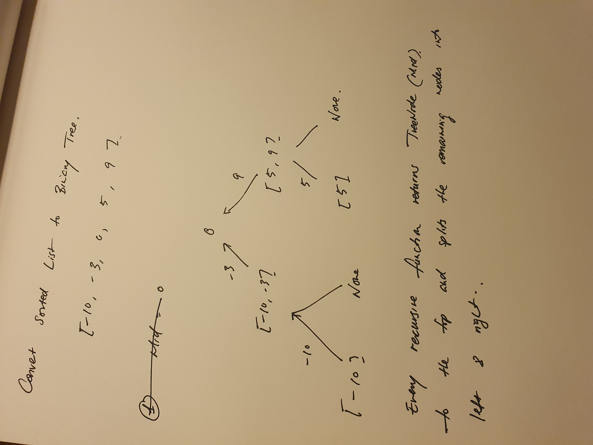

# Binary Search Tree/Recursion: 109. Convert Sorted List to Binary Search Tree

Using Binary Search Tree with Recursion

1. Get all value of the linked list into a List
2. Create a recursive function that will:
    - Take in a list
    - Return the middle value of the list (***rounded up if length of list if even***) as TreeNode with left and right values:
    - Left and right values of the TreeNode will be:
        - The result of the recursive function on the Left and right portions of the remaining nodes



```python
def sortedListToBST(self, head):

    # Recursive function
    def r(nodes):
        if nodes:
            mid = len(nodes)//2
            # Return the middle value as a TreeNode with left and right values as the result of the recursive fucntion on the remaining left and right portions
            return TreeNode(nodes[mid], r(nodes[0:mid]), r(nodes[mid+1:]))
        else:
            return None

    # Gather all the value of the linked list into nodes_list
    nodes_list = []
    node = head
    while node:
        nodes_list.append(node.val)
        node = node.next

    # Return result of recursive function
    return r(nodes_list)
```