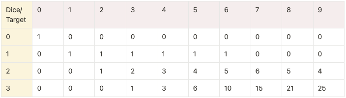

# 1155. Number of Dice Rolls With Target Sum

[Number of Dice Rolls With Target Sum - LeetCode](https://leetcode.com/problems/number-of-dice-rolls-with-target-sum/)

Use a 2D array to keep track of all possible combinations given a dice/target combination

d = number of dice

f = max number on dice

target = sum of dice

d = 2, f = 6, target = 7



Numbers denote the amount of possible combinations for a given amount of dice (yellow) to reach a given target (brown). This would be the combination of the row and column**s** preceding the given cell starting from **target - f.**

For example:

\[2\]\[3\] = \[1\]\[n…\] **where** (target - f) < n < target

The reason why we start from **target - f** is because anything below this range cannot reach the target number.

**For Example:**

Given target = 9, d = 2, f = 6

If a dice roll is below 9 - 6 = 3, then it is impossible to reach target number with the 2nd dice

Code using 2D Array

```python
# 1155. Number of Dice Rolls With Target Sum

def numRollsToTarget(n, k, target):

# Check that n*k can reach target
    if n*k < target:
        return 0

# If n == 1 then only 1 possible solution
    if n == 1:
        return 1

    MOD = (10**9 + 7)

    t = [[0 for x in range(target+1)] for _ in range(n+1)]

    t[0][0] = 1

    for i in range(1, n+1):
        for j in range(i, target+1):
            for m in range(j):
                if (m < j-k and j-k > 0):
                    continue
                t[i][j] += t[i-1][m] % MOD

    return t[len(t)-1][len(t[0]) - 1] % MOD

print(
    numRollsToTarget(30, 30, 500)
)
```
