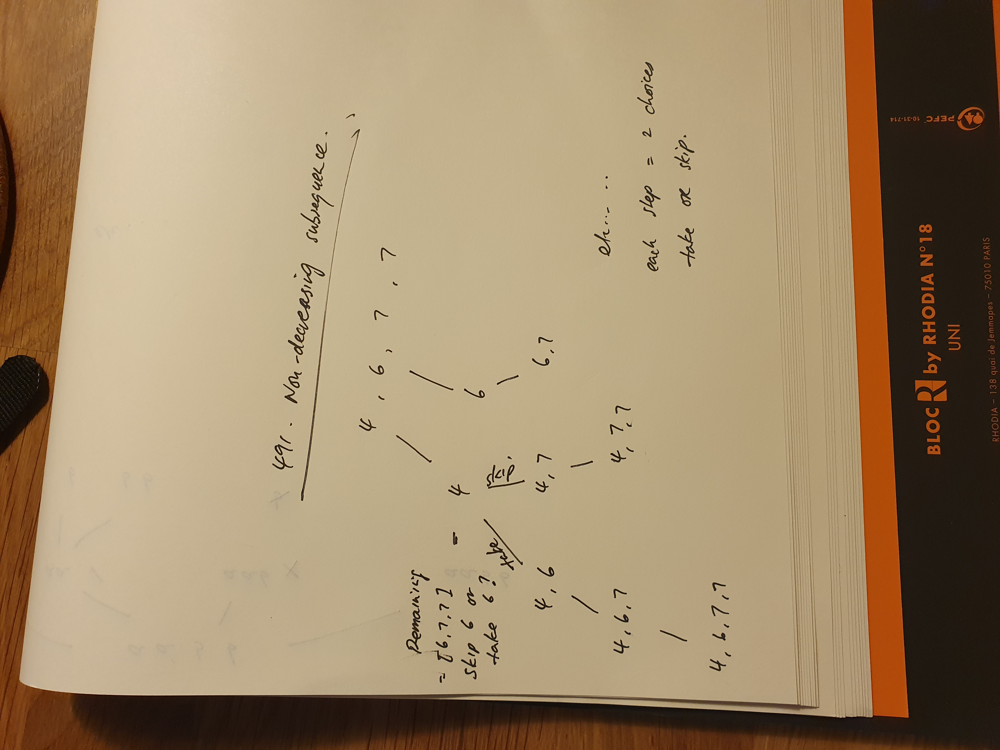

# 491. Backtracking Non-decreasing Subsequences

[https://leetcode.com/problems/non-decreasing-subsequences/description/](https://leetcode.com/problems/non-decreasing-subsequences/description/)

Use backtracking and set. 

Set to avoid duplciates when appending to the ans list

For each number in the list there are 2 choices:

Add to the curr list 

Skip the number

Each time a number is added to curr, we must check that it is still a valid increasing subsequence

If not valid then abandon the tree, and do not explore any further



Code

```python
# 491. Non-decreasing Subsequences

def findSubsequences(nums):

    # Use a set to keep track of duplicates
    ans = set()

    def backtrack(n, curr):

        if n:
            # Check that adding the latest number to curr will still be a valid increasing subsequence
            if len(curr) == 0 or curr[len(curr) - 1] <= n[0]:
                # Check that the curr list is not already in ans to avoid duplicates. Also check that it is not empty
                if tuple(curr + [n[0]]) not in ans and len(curr + [n[0]]) > 1:
                    ans.add(tuple(curr + [n[0]]))
                # 2 choices, either add the next number into curr or skip it
                backtrack(n[1:], curr + [n[0]])
                backtrack(n[1:], curr)
            else:
                # If we can't create a valid increasing subsequence with the first number we need to skip it
                backtrack(n[1:], curr)

    backtrack(nums, [])

    return sorted([list(x) for x in ans])

print(
    findSubsequences([4, 6, 7, 7])
)
```